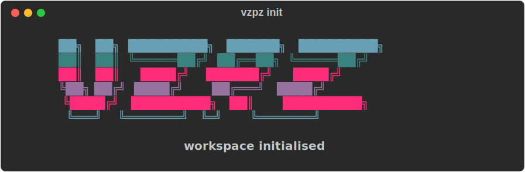

# Veasy Peasy

A local-first CLI tool that scans a folder of visa application documents, extracts structured data using specialized OCR, and matches them against a requirements checklist using a local LLM. No data leaves your machine.

## Why This Exists

For someone like me (a South African living in the UK who travels a bunch) I spend way too much time looking for specific documents from different sources and manually cross-referencing them against a checklist. Since I do this a lot I already have all the documents, I just never remember where I put them. This tool automates that: point it at a folder of scans and a requirements file, and it tells you what's matched, what's missing, and resolves conflicts (e.g., two passports — which one is valid?).

## Next Steps
- [ ] Wire it up end to end
- [ ] Allow it to search through emails as well
- [ ] Enhance local search by giving it multiple folders and nested directory tooling
- [ ] Improve step 1: give the LLM a requirement sheet which it parses into the requirements.yaml
- [ ] I never know which file is which. Get the LLM to save copies of the necessary files in a common space, renamed properly.
- [x] Make it installable as a standalone tool

## Installation (note: not wired up yet so won't actually do anything)

<p align="center">
  
</p>

### curl (macOS)

```bash
curl -fsSL https://raw.githubusercontent.com/benhhack/veasy-peasy/main/install.sh | bash
```

This downloads the latest release binary to `~/.local/bin/vzpz`. Make sure `~/.local/bin` is on your `PATH`.

### Manual download

Grab the binary for your architecture from the [latest release](https://github.com/benhhack/veasy-peasy/releases/latest), make it executable, and put it somewhere on your `PATH`:

```bash
chmod +x vzpz-aarch64-darwin
mv vzpz-aarch64-darwin /usr/local/bin/vzpz
```

### Usage

```bash
vzpz --version
vzpz --help
vzpz init        # initialise a new workspace
```

## Privacy
Since these are sensitive documents, I wanted to keep everything completely local: no external API calls for LLMs. Goal is for it to fit quite comfortably in 8GB RAM and to cleanup totally and immediately upon completion.

## Architecture

Specialised modules do the work; a local LLM decides which to call. Deterministic rules short-circuit obvious cases so small models aren't trusted with problems they'd mishandle.

```
Input: folder/ + requirements.yaml
         │
         ▼
┌─────────────────────────┐
│  File Discovery         │  Walk dir, filter pdf/jpg/png
└─────────────────────────┘
         │
         ▼
┌───────────────────────────────────────────────┐
│  Per-Document Orchestrator                    │
│                                               │
│   1. Deterministic fast path                  │
│      passporteye MRZ  →  passport (skip LLM)  │
│                                               │
│   2. LLM tool-calling loop (Ollama)           │
│      Tools: extract_pdf_text, ocr_image,      │
│             keyword_score, check_mrz          │
│      Up to 5 tool rounds per document.        │
│      Classifies into a requirement category   │
│      declared in requirements.yaml (or        │
│      "unknown").                              │
└───────────────────────────────────────────────┘
         │
         ▼
┌─────────────────────────┐
│  LLM Matcher (Ollama)   │  Match docs → requirements, resolve conflicts
└─────────────────────────┘
         │
         ▼
Output: VzPz_Report_<ts>/
          ├── <requirement>.pdf         # renamed copies of matched files
          ├── summary.json              # full machine-readable run
          ├── report.md                 # human-readable summary
          └── traces/<file>.trace.json  # every tool call and LLM message per document
```

| Stage | Tool | Rationale |
|-------|------|-----------|
| Passport parsing | `passporteye` (MRZ reader) | MRZ is a standardised machine-readable format — deterministic parsing beats probabilistic generation. A valid MRZ short-circuits the LLM. |
| Text extraction | `PyMuPDF` + `EasyOCR` (MPS accelerated) | OCR is a solved problem; the LLM never sees raw bytes, only extractor output. |
| Doc classification | Hybrid orchestrator: deterministic rules + LLM tool-calling | The old keyword classifier only recognised 4 document types and couldn't adapt when new requirements were added. The LLM now orchestrates the specialised extractors and classifies against whatever categories the requirements YAML declares. Deterministic rules keep unambiguous cases (valid passport MRZ) out of the LLM entirely. |
| Requirement matching | Local LLM via Ollama | Fuzzy matching, conflict resolution, validation of classifications. |

### Debugging: per-document traces

Every classification decision is recorded as `traces/<file>.trace.json` inside the report folder. Each trace captures the decision path (`deterministic_mrz` or `llm_orchestrator`), every tool call with arguments and elapsed time, the LLM's message content between tool calls, and the final parsed classification. When a document misclassifies, the trace shows exactly which tool was called, what it returned, and what the LLM concluded — making prompt and model failures debuggable instead of opaque.

## Model Evaluation

Choosing the right small language model for the matching step is critical — it needs to run locally, produce valid JSON, and handle edge cases. I built an evaluation harness that tests 4 models across 6 scenarios.

### Models Tested

| Model | Parameters | Notes |
|-------|-----------|-------|
| llama3.2:3b | 3B | Meta's compact model |
| phi4-mini | 3.8B | Microsoft's reasoning-focused model |
| qwen2.5:3b | 3B | Alibaba's instruction-tuned model |
| gemma3:4b | 4B | Google's lightweight model |

### Evaluation Scenarios

| Scenario | What it tests |
|----------|--------------|
| **happy_path** | All required documents present with clear matches |
| **missing_docs** | Some requirements have no matching document |
| **conflicts** | Two passports found (one expired) — must pick the valid one |
| **bad_classification** | Employment letter misclassified as bank statement — LLM should flag it |
| **noisy_ocr** | Documents with garbled OCR text (character substitutions, partial reads) |
| **extra_documents** | 6 files for 3 requirements — must match correctly and ignore irrelevant docs |

### Results

| Model | Tok/s | Parse % | Match F1 | Miss F1 | Conflict % | Valid % | **Score** |
|-------|-------|---------|----------|---------|------------|---------|-----------|
| llama3.2:3b | 34.6 | 100% | 1.00 | 0.28 | 17% | 83% | 0.72 |
| phi4-mini | 27.4 | 100% | 0.97 | 0.50 | 33% | 83% | 0.78 |
| qwen2.5:3b | 32.7 | 100% | 1.00 | 0.67 | 50% | 83% | **0.85** |
| gemma3:4b | 26.9 | 100% | 0.97 | 0.50 | 67% | 83% | 0.81 |

*Composite score weights: match F1 (35%), missing F1 (25%), parse rate (20%), conflict detection (10%), validation (10%)*

### Key Findings

- **All models achieve 100% JSON parse rate** — the prompt template with explicit schema works well
- **Document matching is the easy part** — all models score >= 0.97 F1 on matching documents to requirements
- **Missing document detection separates the field** — llama3.2 frequently hallucinates missing docs that aren't actually missing (0.28 F1), while qwen2.5 correctly identifies gaps (0.67 F1)
- **Conflict resolution is the hardest task** — only gemma3 (67%) and qwen2.5 (50%) reliably detect when two documents compete for the same requirement. llama3.2 invents conflicts that don't exist
- **OCR noise is a non-issue** — all models handle garbled text gracefully, matching through character-level corruption
- **phi4-mini and gemma3 are the only models that flag misclassified documents** — both correctly identified an employment letter wrongly labelled as a bank statement

### Model Choice: qwen2.5:3b

**qwen2.5:3b** scores highest overall (0.85) with the best balance of accuracy and speed:
- Perfect document matching (F1 = 1.00)
- Best missing document detection (F1 = 0.67)
- Second-fastest inference (32.7 tok/s)
- Reliable JSON output (100% parse rate)

Its main weakness is validation — it doesn't flag misclassified documents. The orchestrator is now the first line of defence on classification quality, so a weaker validation pass on the matcher is an acceptable trade-off. For applications where upstream classification is less reliable, gemma3:4b would be the better choice despite being slower.

> Note: the eval harness currently benchmarks the **matcher** (LLM reasoning over already-classified files). A separate evaluation of the new per-document orchestrator is the natural next step.

## Prerequisites

- macOS (Apple Silicon recommended for MPS acceleration)
- Python 3.13+
- [uv](https://docs.astral.sh/uv/)
- Tesseract: `brew install tesseract`
- [Ollama](https://ollama.ai) running locally

## Quickstart

```bash
uv sync
ollama pull qwen2.5:3b
uv run veasy-peasy ./example_documents --requirements example_requirements/visa_schengen.yaml
```

## Running the Model Evaluation

```bash
# Single run (fast)
.venv/bin/python tests/test_model_eval.py

# Multiple runs for variance estimation
EVAL_RUNS=3 .venv/bin/python tests/test_model_eval.py

# Via pytest
.venv/bin/python -m pytest tests/test_model_eval.py -s --tb=short
```

Results are saved to `tests/eval_results.json` and `eval_report.md`.

## Tech Stack

| Component | Tool |
|-----------|------|
| CLI | `typer` |
| Passport OCR | `passporteye` |
| General OCR | `easyocr` (MPS accelerated) |
| PDF handling | `pymupdf` |
| Doc classification | Hybrid orchestrator (deterministic MRZ + LLM tool-calling) |
| Local LLM | Ollama + qwen2.5:3b (tool-calling via `/api/chat`) |
